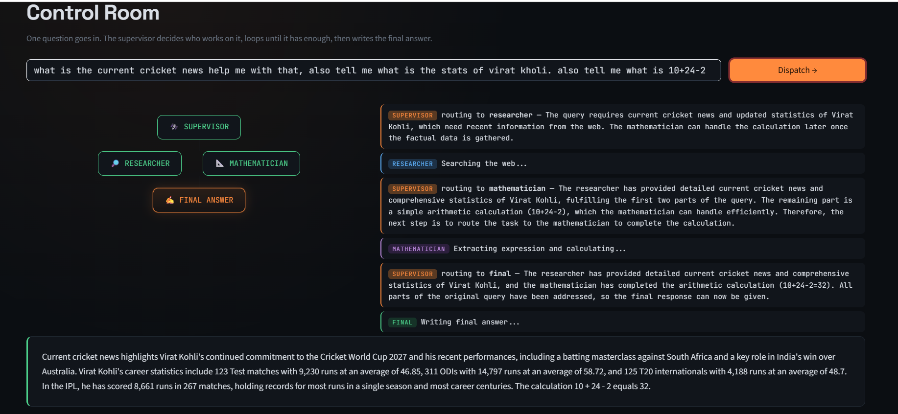

# Control Room — Multi-Agent Supervisor System

A multi-agent system built with **LangGraph**, where a supervisor agent dynamically routes a user's query between a **researcher** (web search), **Chart Maker** and a **mathematician** (calculations), looping until it has enough information to produce a final answer. Includes a Streamlit UI that visualizes the routing decisions and the agent trace in real time.

<a href="https://your-demo-link.com">
  
</a>

---

## How it works

```
        START
          ↓
     ┌──supervisor◄──────┐
     │     ↓             │
     │  ┌──┴────┐─┐      │
     ↓  ↓       ↓ ↓      │
researcher  mathematician│
     │         │  ↓      │
     └────┬────┘ Chart Maker       
          └───────────────┘   (loop back via Command(goto="supervisor"))

     supervisor → "final" → final → END
```

1. The **supervisor** node reads the original query and everything done so far, then makes a structured routing decision: send the task to `researcher`, `mathematician`, or move to `final`.
2. The **researcher** node runs a Tavily web search and reports back to the supervisor.
3. The **mathematician** node extracts the exact mathematical expression from the query using a structured-output LLM call, evaluates it safely, and reports back to the supervisor.
4. The supervisor keeps looping between workers until it decides enough information has been gathered, then routes to **final**, which writes a single clean answer for the user.

All routing is handled with LangGraph's `Command(goto=...)` — there's no separate conditional-edges definition; each node decides its own next step.

---

## Tech stack

| Component | Tool |
|---|---|
| Orchestration | LangGraph (`StateGraph`, `Command`) |
| LLM | OpenAI (`gpt-4.1-mini`) via `langchain_openai` |
| Structured output | Pydantic models (`SupervisorDecision`, `FinalAnswer`, `MathStringExtractor`) |
| Web search | Tavily (`TavilySearchResults`) |
| UI | Streamlit |

---

## Project structure

```
.
├── supervisor_agent.py   # Core agent logic (terminal version, input()-based)
├── app.py                # Streamlit UI — same logic, with live visualization
├── requirements.txt
└── README.md
```

---

## Setup

### 1. Clone and create an environment

```bash
git clone <your-repo-url>
cd <repo-folder>
python -m venv myenv
myenv\Scripts\activate        # Windows
# source myenv/bin/activate   # Mac/Linux
```

### 2. Install dependencies

```bash
pip install -r requirements.txt
```

Or manually:

```bash
pip install langgraph langchain-openai langchain-community tavily-python python-dotenv streamlit
```

### 3. Add your API keys

Create a `.env` file in the project root:

```bash
OPENAI_API_KEY=sk-...
TAVILY_API_KEY=tvly-...
```

> Get a free Tavily key at [tavily.com](https://tavily.com) — the free tier includes 1000 searches/month.

---

## Usage

### Terminal version

```bash
python supervisor_agent.py
```

You'll be prompted to type a question directly in the terminal.

### Streamlit version (recommended)

```bash
streamlit run app.py
```

Type a question in the input box and click **Dispatch →**. Watch the org chart light up as the supervisor routes the task, and read the live log as each agent reports back. The final answer appears at the bottom once the supervisor decides it has enough information.

---

## Example queries

```
What is the GDP of India in 2025 and what is 10 + 24 - 2?
Who is the current Prime Minister of India?
What is 25 * 4?
What is the current cricket news and what are Virat Kohli's stats? Also what is 10+24-2?
```

---

## Notes

- The `calculate` tool runs `eval()` with restricted builtins as a safety measure — it's fine for this learning project, but a stricter math parser (e.g. `ast` or `numexpr`) would be safer in production.
- The supervisor relies entirely on structured output (Pydantic + `with_structured_output`) for its routing decisions, rather than parsing free-text LLM responses — this makes the routing reliable and type-safe.
- There's no hard retry limit on the supervisor loop yet; for production use, consider adding a max-iteration guard to avoid runaway loops.
